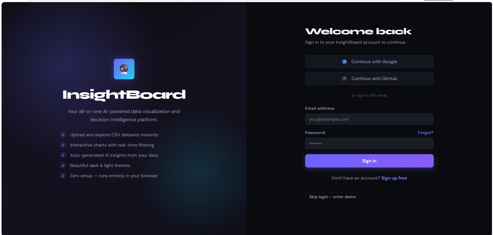
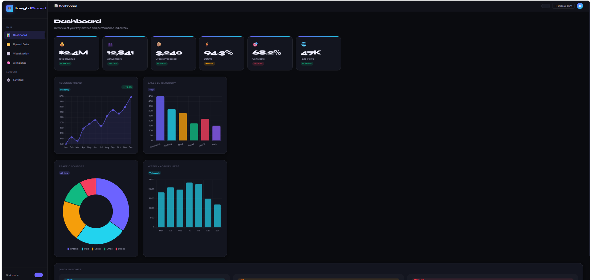
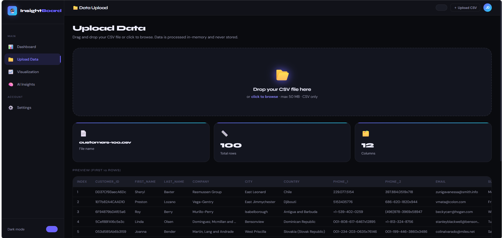
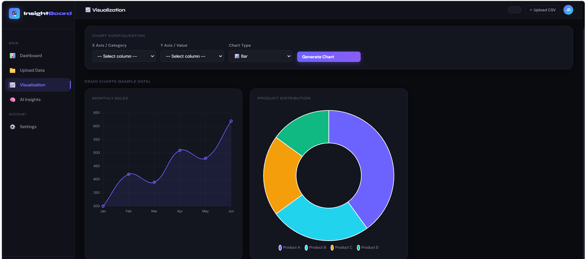
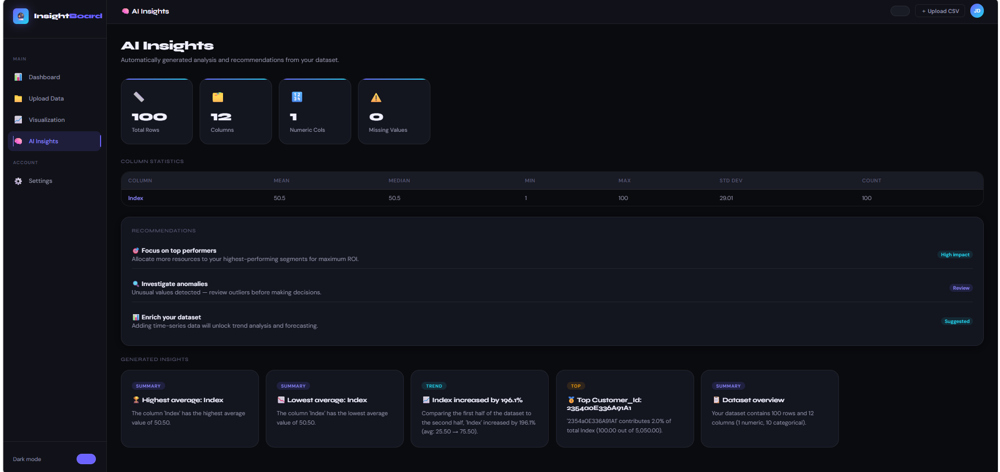

# 🔮 InsightBoard — Data Visualization & Insight Dashboard

A clean and interactive web application to upload CSV data, visualize it using charts, and extract meaningful insights — all in one place.

---

## 🚀 Live Demo
👉 https://69e7ef4f6a05773b250d031f--splendorous-pie-188d4e.netlify.app/

---

## 📌 About the Project

InsightBoard is designed to make data exploration simple.

Instead of using heavy tools or writing code, users can directly upload a dataset and start analyzing it through an intuitive interface. The application processes data in real-time and provides visual as well as statistical insights.

---

## 📸 Screenshots

### 🔐 Login Page


### 📊 Dashboard


### 📁 Upload Data


### 📈 Visualization


### 🧠 Insights


---

## ✨ Features

- Upload CSV files with instant preview  
- Interactive charts (Bar, Line, Pie, Doughnut)  
- Automatic insight generation  
- KPI dashboard for quick overview  
- Dynamic column-based visualization  
- Dark / Light theme support  
- Fully responsive UI  
- No database required (in-memory processing)  

---

## 🧠 How It Works

1. User uploads a CSV file  
2. Backend processes data using Pandas  
3. Cleaned data is stored temporarily in memory  
4. Charts are generated dynamically using API  
5. Insights are calculated using statistical methods  

---

## 🏗️ Project Structure

```
InsightBoard/
│
├── backend/
│   ├── app.py                # Flask main server
│   ├── utils.py              # Data processing & insights logic
│   ├── requirements.txt      # Python dependencies
│   └── __pycache__/          # Auto-generated (ignored)
│
├── frontend/
│   │
│   ├── index.html            # Main UI (all pages)
│   ├── style.css             # Styling (dark/light theme)
│   ├── script.js             # Frontend logic + API calls
│   │
│   └── assets/               # Screenshots / images
│       ├── login.png
│       ├── dashboard.png
│       ├── upload.png
│       ├── visualization.png
│       └── insights.png
│
├── .gitignore                # Ignore unnecessary files
├── README.md                 # Project documentation
└── LICENSE                   # Optional
```

---

## 🔌 API Endpoints

### 📁 Upload CSV
```
POST /upload
```

### 📊 Get Data
```
GET /data
```

### 🧠 Get Insights
```
GET /insights
```

### 📈 Generate Charts
```
GET /charts
```

---

## 🛠️ Tech Stack

### Frontend
- HTML  
- CSS  
- JavaScript  
- Chart.js  

### Backend
- Python  
- Flask  
- Pandas  
- NumPy  

---

## 🚀 Run Locally

### 1. Clone the repository
```
git clone <your-repo-link>
cd InsightBoard
```

### 2. Install dependencies
```
pip install -r requirements.txt
```

### 3. Run backend server
```
python app.py
```

### 4. Open frontend
Open `index.html` in your browser

---

## 📈 Future Scope

- User authentication system  
- Persistent database storage  
- Advanced analytics and filters  
- Export charts as images or reports  
- Machine learning-based predictions  

---

## 👨‍💻 Author

**Shubhankar Pandey**

---

## ⭐ Final Note

This project focuses on making data analysis simple, fast, and accessible without requiring technical expertise.

---
